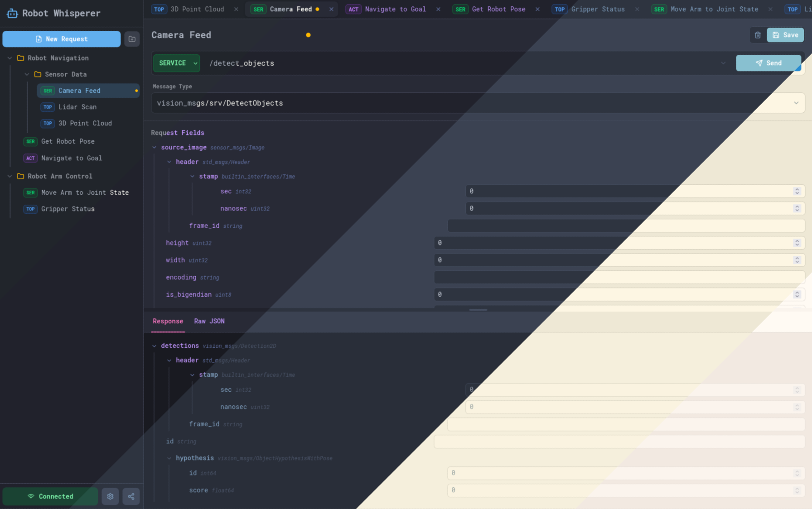

# Robot Whisperer

Robot Whisperer is a developer tool that simplifies interaction with ROS 2 systems. Inspired by Postman, it provides a user-friendly interface for creating, managing, and sending requests to ROS 2 topics, services, and actions.

This application is built with Svelte 5 and Tauri, allowing it to be deployed as both a web application and a native desktop app for Windows, macOS, and Linux.

> [!NOTE]
> **Try it now!** You can test the web version of Robot Whisperer at: [https://ros.heroicwaffle.dev/](https://ros.heroicwaffle.dev/)

<p align="center">
    
</p>


> [!IMPORTANT]
> Currently the application is going through a complete rewrite in Svelte 5. Because of this, many of the features haven't been re-implemented yet. 
> 
> To check the ongoing progress, please check the [milestones](https://github.com/Mika412/RobotWhisperer/milestone/1).

## Supported Connections 🔗

Robot Whisperer supports various connection methods to interface with ROS:

### Current

- **Foxglove Bridge (ROS 2)** (ongoing) - WebSocket-based connection to ROS 2 system

### Future

- **Rust (native)** - Native implementation using `rclrs`
- **Foxglove Bridge (ROS 1)** - WebSocket-based connection to ROS 1 system
- **Rosbridge** - Traditional rosbridge protocol support

## Installation and Setup 🛠️

To get started with Robot Whisperer, you'll need to have [Bun](https://bun.com/docs/installation) and [Rust](https://www.rust-lang.org/tools/install) set up on your machine.

Clone the repository:

```shell
git clone https://github.com/mika412/robotwhisperer.git
cd robotwhisperer
```

Install dependencies:

```shell
bun install
```

Run the Web App:

```shell
bun dev
```
This will start the development server for the web application. You can access it at `http://localhost:1420`.

Run the Desktop App:

```shell
bun tauri dev
```
This will launch the Tauri application in development mode.


## Building for Deployment 📦

You can build Robot Whisperer for both web and desktop.

#### Web App:

```shell
bun run build
```

This will create a build directory with the static files for the web application.

#### Desktop App:

```
bun run tauri build
```

This will build the application for your current platform and create an installer in the `src-tauri/target/release` directory.

## Contributing 🤝

Contributions are welcome! This project is still in its early stages, so any help is appreciated.