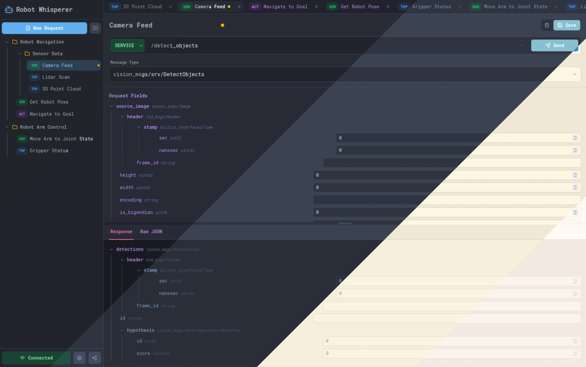

# Robot Whisperer

Robot Whisperer is a Postman-style client for ROS. It gives you one interface to connect to a robot, browse its topics, services, and actions, send and inspect messages, and build live dashboards from the data, without writing throwaway scripts or running `ros2 topic echo` across a dozen terminals.

Built with SvelteKit (Svelte 5) and Tauri 2 on top of a Rust core that compiles to both a native binary and WebAssembly, it runs as a desktop app and in the browser from a single codebase.

> [!NOTE]
> Try it now in your browser at [ros.heroicwaffle.dev](https://ros.heroicwaffle.dev).

<p align="center">
    
</p>

## Features

- **Requests.** Subscribe to topics, call services, and send or cancel action goals. Message payloads are entered through a schema-driven form, and results stream into a live view.
- **Visualizers.** Any compatible request can be rendered, not just shown as JSON: images (`sensor_msgs/Image`, including compressed), point clouds (`visualization_msgs/MarkerArray`), and streaming plots of any numeric field.
- **Dashboards.** Arrange panes in resizable splits, group them into tabs, drag to re-dock, maximize, and go fullscreen. Layouts are persisted locally.
- **Built-in panes.** Raw/JSON, streaming Plot, Image, and Point Cloud, all sharing the same visualizer layer as the request view.
- **Custom panes.** A small plugin API: a pane is a Svelte component plus a descriptor, with topic subscription and service/action calls provided through a narrow context.
- **Workspace import/export.** Connections, requests, and collections are stored in SQLite (native) or IndexedDB (web) and can be exported and imported as human-readable JSON.
- **Theming.** Seven built-in themes, applied instantly and persisted.

## Connectivity

Connections are defined by a transport and a URL.

- **Foxglove WebSocket.** Connects to `foxglove_bridge` for both ROS 1 and ROS 2.
- **rosbridge.** The rosbridge v2 protocol over WebSocket, for both ROS 1 and ROS 2.
- **Dummy.** An offline transport that emits synthetic topics, services, and actions, so you can try the app or run tests with no robot available.

Native ROS 2 (via `rclrs`) is planned.

## Architecture

A single runtime-agnostic pipeline sits behind every transport. It keeps exactly one upstream subscription per `(connection, topic)` and ref-counts a zero-copy fan-out to all consumers, decodes messages off the main thread, and exposes a uniform command surface (open/close, subscribe, call service, send goal). This core lives in a multi-crate Rust workspace under `src-tauri/` and is shared by two front ends: the native build talks to it over Tauri IPC with a loopback-WebSocket ingest path, and the web build calls the same code compiled to WebAssembly. The frontend is therefore identical across desktop and web.

## Getting started

### Prerequisites

- [Bun](https://bun.com/docs/installation)
- [Rust](https://www.rust-lang.org/tools/install)
- For web/WASM builds: [`wasm-pack`](https://rustwasm.github.io/wasm-pack/installer/) and the `wasm32-unknown-unknown` target (`rustup target add wasm32-unknown-unknown`)
- For desktop builds: the platform dependencies listed in the [Tauri prerequisites](https://tauri.app/start/prerequisites/)

### Install

```shell
git clone https://github.com/Mika412/RobotWhisperer.git
cd RobotWhisperer
bun install
```

### Run

Web (development):

```shell
bun run web
```

This builds the WASM module and serves the app at `http://localhost:5173` with hot reload. With no robot at hand, add a **Dummy** connection from the sidebar to stream synthetic data. `bun run web` uses a development WASM build. Use `bun run web:release` to run the optimized build.

Desktop (development):

```shell
bun run tauri dev
```

## Building

Web (static site):

```shell
bun run build
```

Outputs an optimized, self-contained site to `build/`, deployable to any static host. Serve it locally with `bun run preview`.

Desktop (installer for the current platform):

```shell
bun run tauri build
```

Platform-specific bundles are also available via `bun run tauri:build:linux` (AppImage) and `bun run tauri:build:macos:arm` / `:macos:intel` (`.app` and `.dmg`). Artifacts are written under `src-tauri/target/`.

## Development

```shell
bun run check     # svelte-check (types)
bun run lint      # eslint
bun run test      # vitest unit tests
bun run format    # prettier --write
```

For the Rust workspace, in `src-tauri/`:

```shell
cargo fmt
cargo clippy --workspace --all-targets -- -D warnings
cargo nextest run --workspace
```

## License

Released under the [MIT License](./LICENSE).
